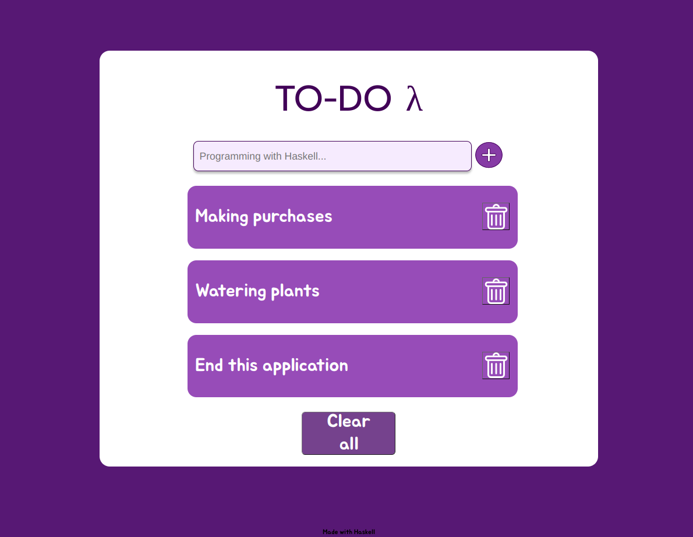

# TO-DO Lambda

This is a simple implementation of a TODO web application using WebSockets and Haskell.



## How to run

```bash
$ stack run
Setting phasers to stun... (port 3000) (ctrl-c to quit)
```
And then open your browser at [http://localhost:3000](http://localhost:3000).

## How was it made

This project was made using the [Scotty]() library for the web server and the [WebSockets]() library for the websockets.

### HTML over WebSockets

The idea is keep the logic of the application in the server and send fragments of HTML to the client, using the minimum amount of JavaScript possible. The client receives the HTML and inserts it into the DOM.

### The server

The server is a simple web server that serves the static files and the websockets. The websockets are used to send the HTML fragments to the client.

### The client

The client is a simple HTML page that has a form to add new TODOs and a list of TODOs. The client also has some event listeners to handle the events sent by the server. And depending on the event, the server will send a different HTML fragment to the client.

## TODO

- [x] Add a way to add new TODOs
- [x] Add a way to clear all TODOs
- [ ] Add a database to store the TODOs
- [ ] Add a way to delete TODOs
- [ ] Add a way to mark TODOs as done
- [ ] Add a way to edit TODOs
- [ ] Add a way to filter TODOs
- [ ] Add a way to sort TODOs
- [ ] Add a way to search TODOs
- [ ] Add a way to add tags to TODOs
